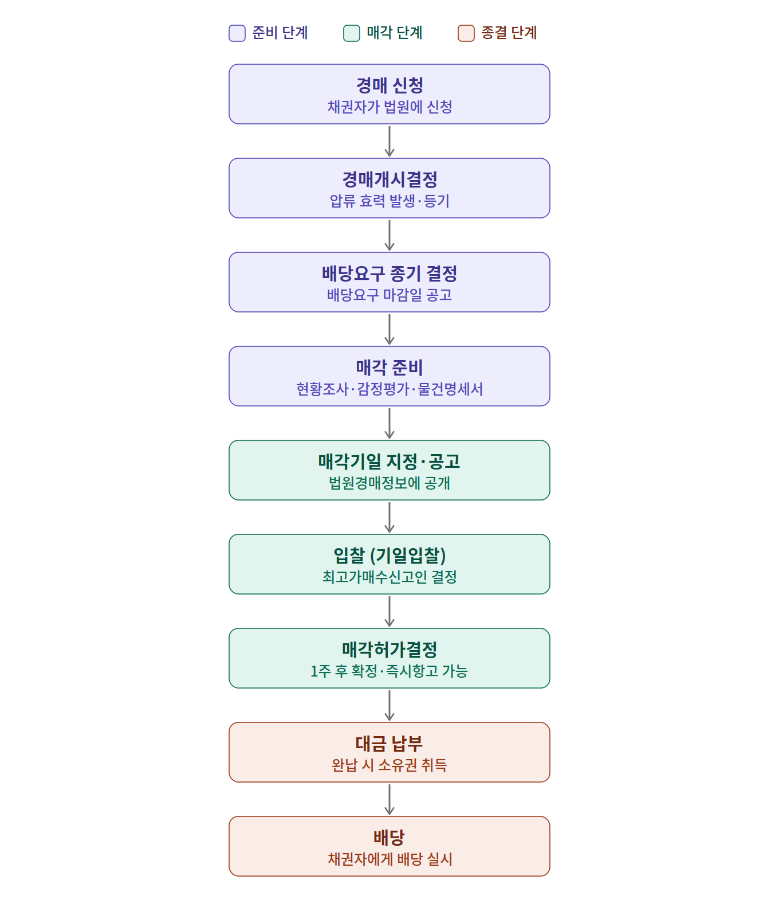

경매 절차는 현행 기준(민사집행법, 2026년 5월 기준)으로 확인했습니다. 절차 자체는 안정적이고, 교육 프로젝트의 진짜 핵심은 "절차 암기"가 아니라 **권리분석**이라는 점이 설계의 출발점이 됩니다. 먼저 절차를 흐름도로 정리하고, 그 위에 교육 설계와 역할 분담을 얹겠습니다.이제 절차 흐름도부터 보시죠. 법원경매(강제·임의경매) 기준이며, 색으로 3단계를 구분했습니다.

위 흐름이 법원경매의 기본 절차입니다. 그런데 교육 프로젝트를 설계할 때 가장 중요한 인사이트는 이겁니다 — **절차(흐름) 자체는 외우면 끝나는 쉬운 부분이고, 학습자가 실제로 돈을 잃고 어려워하는 지점은 "권리분석"** 이라는 거예요. 여기에 AI 교육의 가치가 집중되어야 합니다.

**절차의 핵심 = 권리분석**

권리분석의 출발점은 **말소기준권리**입니다. 등기부에서 (근)저당권·(가)압류·담보가등기·경매개시결정 등 중 가장 앞선 것을 기준선으로 잡고, 그보다 앞선 권리는 매수인에게 **인수**, 뒤선 권리는 **말소**된다는 원리죠. 등기부에서 말소기준권리를 빠르게 찾아낸 뒤 그보다 앞선 날짜의 권리가 있는지 확인하는 것이 권리분석의 본질이며, 이 기준선 하나만 정확히 이해해도 사고의 대부분을 예방할 수 있습니다.

가장 까다로운 쟁점은 **임차인의 대항력**입니다. 임차인이 전입신고·점유 등 대항요건을 말소기준권리 설정일보다 앞서 갖추면 대항력이 있고, 같은 날이거나 이후면 대항력이 없습니다. 대항력 있는 임차인의 보증금은 낙찰자가 떠안을 수 있어서, 여기서 초보자가 가장 크게 손해를 봅니다. 또 유치권·법정지상권·분묘기지권 등은 등기 순위와 무관하게 인수되는 함정도 있죠. 즉 교육 콘텐츠의 70~80%는 절차가 아니라 이 권리분석 영역에 들어가야 합니다.

**교육 프로젝트화: 고려할 점**

경매는 "실제 돈과 법적 책임"이 걸린 도메인이라, 일반 챗봇과 다른 설계 원칙이 필요합니다.

첫째, **포지셔닝을 "학습/교육용"****으로**** 명확히 못 박을 것.** 특정 물건에 대해 "이거 사도 됩니다 / 권리분석상 안전합니다"라고 단정하면 곧바로 투자자문·법률자문 책임 문제가 생깁니다. AI는 개념을 가르치고 분석을 *연습시키는* 역할까지만. 결론 화면마다 "참고용이며 실제 입찰 전 전문가 확인 필요" 디스클레이머를 둡니다. 이건 발표에서도 "우리는 리스크를 인지하고 설계에 반영했다"는 강점으로 어필됩니다.

둘째, **데이터 출처는 공공·법령 중심으로.** 데모 단계에서 상업 경매정보(지지옥션 등) 크롤링은 비용·약관 리스크가 있으니 피하고, 무료·공식 소스로 지식베이스를 구성하세요.

| **용도** | **소스** |
| --- | --- |
| 법령(RAG 핵심) | 국가법령정보센터 — 민사집행법, 주택·상가임대차보호법 |
| 절차·해설 | 찾기쉬운 생활법령정보(easylaw), 대법원 법원경매정보 |
| 실물 자료 | 매각물건명세서·현황조사서·감정평가서 샘플(법원경매정보 공개분) |
| 연습용 | 직접 제작한 가상 매각물건명세서 + 정답 권리분석 |

셋째, **RAG가 잘 맞는 곳과 위험한 곳을 분리.** 절차 안내·용어 설명·법령 인용·개념 학습은 RAG가 강점을 발휘합니다. 반면 특정 물건의 정확한 권리분석 단정이나 배당금액 계산은 환각(hallucination) 시 실제 피해로 직결되므로, "가상 사례 기반 학습/연습"으로 한정하고 항상 **출처 조문을 인용**하게 하세요.

**시스템 설계 (****멀티에이전트**** RAG)**

프로그램 주제(에이전트)와 보유 스택(Streamlit + GPT-4o-mini + ChromaDB + LangChain + 한국어 임베딩)에 그대로 얹어, **오케스트레이터가**** 질문을 4개 전문 에이전트로 라우팅**하는 구조를 권합니다. 멀티에이전트라 데모 임팩트도 큽니다.

이전에 작업하신 **법률 문서 clause-aware ****청킹**이 그대로 핵심 자산이 됩니다 — 법령을 조문 단위로 끊어 ChromaDB에 넣으면, 답변마다 정확한 조문 인용이 가능해져 신뢰성 문제를 상당히 해결합니다.

- 오케스트레이터(Router): LangChain 라우터가 질문 의도를 분류해 분배

- ① 절차 안내 에이전트: "지금 단계 다음은?", "배당요구 종기란?" 등 흐름 Q&A

- ② 권리분석 튜터 에이전트: 말소기준권리·대항력을 가상 사례로 단계별로 가르침 (단정 금지, 학습 유도형)

- ③ 법령·용어 사전 에이전트: 조문·용어를 출처와 함께 인용

- ④ 사례·퀴즈 에이전트: 가상 매각물건명세서를 주고 권리분석 문제 출제·채점

ChromaDB는 컬렉션을 법령 / 절차해설 / 용어집 / 가상사례로 나눠 라우팅 정확도를 높이면 됩니다.

**4인 역할 분담 (6/26 데모 기준)**

11일 남았으니 병렬로 가야 합니다. 

- **기획/PM/도메인**** ** — 전체 시나리오·UX 설계, 권리분석 교육 콘텐츠 설계(가상 사례·정답 세트 제작), 오케스트레이터 라우팅 규칙 정의, 발표·데모 시나리오. 도메인을 가장 잘 아는 사람이 콘텐츠 정합성을 책임지는 게 맞습니다.

- **데이터·지식베이스 담당** — 법령/절차/용어 수집·정제, clause-aware 청킹, 한국어 임베딩, ChromaDB 4개 컬렉션 구축.

- **에이전트·****백엔드**** 담당** — LangChain 멀티에이전트+라우터 구현, GPT-4o-mini 프롬프트 엔지니어링, RAG 파이프라인·출처 인용 로직.

- **프론트·통합 담당** — Streamlit UI(에이전트별 탭/챗), 통합, Streamlit Cloud 배포, 사전 QA

- 추천 마일스톤: ~6/18 데이터·콘텐츠 확정 + 단일 에이전트 RAG 동작 → ~6/22 멀티에이전트 라우팅·UI 통합 → 6/23~25 QA·발표 리허설.

스코프 현실화 팁 하나 — 데모에서는 실시간 경매정보 연동을 욕심내지 말고, 잘 만든 **가상 사례 3~5건**으로 "권리분석을 가르치고 퀴즈로 검증하는" 플로우를 깔끔하게 보여주는 게 점수가 더 높습니다.

권리분석 튜터 에이전트의 대화 시나리오나 가상 매각물건명세서 샘플부터 같이 만들어볼까요?

**부동산 경매 교육 ****멀티에이전트**** RAG (가칭)**

부동산 법원경매를 **가르치고 ****연습시키는** 학습용 AI 서비스. 오케스트레이터가 질문을 전문 에이전트로 분배하는 멀티에이전트 RAG 구조.

⚠️ 본 서비스는 **교육·학습용**입니다. 특정 물건에 대한 투자·법률 자문이 아니며, 실제 입찰 전에는 반드시 전문가 확인이 필요합니다. 모든 답변에 출처(조문)를 함께 제시합니다.

**에이전트 구성 (목표)**

- **오케스트레이터****(Router)**: 질문 의도를 분류해 적절한 에이전트로 분배

- **① 절차 안내**: 경매 흐름·단계 Q&A

- **② 권리분석 ****튜터**: 말소기준권리·대항력을 가상 사례로 단계별 학습 (단정 금지)

- **③ 법령·용어 사전**: 조문/용어를 출처와 함께 인용

- **④ 사례·퀴즈**: 가상 매각물건명세서로 권리분석 문제 출제·채점

**지식베이스(****ChromaDB****) 4개 컬렉션**

| **컬렉션** | **내용** | **데이터** |
| --- | --- | --- |
| auction_laws | 법령 조문 | data/laws/*.md |
| auction_procedures | 절차 해설 | data/procedures/*.md |
| auction_glossary | 용어집 | data/glossary/glossary.json |
| auction_cases | 가상 사례 | data/cases/sample_cases.json |

**현재 디렉터리 구조 (1단계 ****완료분****)**

auction-edu-rag/

├── README.md

├── requirements.txt

├── .env.example

├── .gitignore

├── config.py                # LLM/임베딩/컬렉션/경로 중앙 설정 (GPT<->Claude 전환)

└── data/

    ├── laws/

    │   ├── civil_execution_act.md          # 민사집행법 핵심 조문

    │   └── housing_lease_protection_act.md # 주택임대차보호법 핵심 조문

    ├── procedures/

    │   └── auction_procedure_guide.md      # 9단계 절차 해설

    ├── glossary/

    │   └── glossary.json                   # 용어 21개

    └── cases/

        └── sample_cases.json               # 가상 사례 3건(입문/중급/고급) + 정답

이후 단계에서 ingest.py(청킹·DB구축), agents/, app.py(Streamlit) 등이 추가됩니다.

**실행 준비 (지금 단계)**

# 1) 가상환경

python -m venv venv && source venv/bin/activate   # Windows: venv\Scripts\activate

# 2) 설치

pip install -r requirements.txt

# 3) 키 설정

cp .env.example .env   # 그리고 .env 안의 키를 채움

실제 동작(ingest/app)은 2단계 이후 코드가 추가되면 진행합니다.

**동작 테스트 (2~3단계)**

python ingest.py            # chroma_db/ 구축 (최초 1회, 키 필요)

python cli.py "배당요구 종기가 뭐야?"   # 절차 안내 에이전트에 질문

**앱 실행 (6단계)**

python ingest.py            # 최초 1회 DB 구축

streamlit run app.py        # 웹 UI 실행 (채팅 + 퀴즈 채점)

**LLM / ****임베딩**** 전환**

.env의 LLM_PROVIDER만 openai ↔ anthropic으로 바꾸면 GPT-4o-mini ↔ Claude 전환. 한국어 로컬 임베딩이 필요하면 EMBEDDING_PROVIDER=huggingface로 변경.

**빌드 로드맵**

- [x] **1단계**: 프로젝트 구조 + 샘플 지식베이스

- [x] **2단계**: clause-aware 청킹 → ChromaDB 4개 컬렉션 구축 (ingest.py)

- [x] **3단계**: 단일 RAG 에이전트(절차 안내) 동작 (rag.py, agents.py, cli.py)

- [x] **4단계**: 권리분석 튜터(agents.py) + 사례·퀴즈 에이전트(quiz.py)

- [x] **5단계**: 라우터로 멀티에이전트 통합 (router.py)

- [x] **6단계**: Streamlit UI + 출처 표시 + 퀴즈 채점 (app.py)

- [x] **7단계**: Streamlit Cloud 배포 준비 (DEPLOY.md, .streamlit/config.toml)

**팀 역할(제안)**

- 팀장/기획·도메인: 시나리오·UX 설계, 권리분석 콘텐츠/사례 정합성, 라우팅 규칙 정의

- 데이터·지식베이스: 데이터 수집·정제, 청킹, 임베딩, ChromaDB 구축

- 에이전트·백엔드: LangChain 멀티에이전트·라우터, 프롬프트, RAG 파이프라인

- 프론트·통합: Streamlit UI, 통합, 배포, QA

**1단계** 요약:

- 프로젝트 골격 — config.py(LLM/임베딩 중앙 설정, .env에서 LLM_PROVIDER만 바꾸면 GPT↔Claude 전환), requirements.txt, .env.example, .gitignore, README.md

- 지식베이스 4종 (ChromaDB 컬렉션과 1:1 매핑) 

- 법령: 민사집행법 핵심 조문(말소·인수의 근거인 제91조 포함) + 주택임대차보호법(대항력·우선변제·최우선변제)

- 절차 해설: 9단계

- 용어집: 21개

- 가상 사례 3건 + 정답 권리분석 — 입문(대항력 없는 안전 물건) / 중급(선순위 대항력 임차인, 입찰가에 따른 인수 위험) / 고급(유치권 인수). 이게 권리분석 튜터·퀴즈 에이전트의 핵심 자산입니다.

법령은 조문 단위(## 제○○조) 헤더로 작성해 2단계 clause-aware 청킹에 바로 맞물리게 했고, 사례 JSON은 문제로 보여줄 부분과 채점용 analysis(정답)를 분리해 뒀습니다. 키 없이 검증 가능한 부분(JSON 유효성·데이터 정합성·config 로딩)은 여기서 직접 돌려 통과 확인했습니다.

법령/사례 내용은 정확한 요약이지만 프로토타입 시드 데이터이니, 운영 단계에서는 국가법령정보센터 공식 전문으로 교체하시면 됩니다.

바로 **2단계(ingest.py — 청킹 + ChromaDB 4개 컬렉션 구축)**로 넘어갈까요? 그 전에 임베딩을 기본값인 OpenAI text-embedding-3-small로 갈지, 한국어 로컬 모델(ko-sroberta 등)로 갈지만 정해주시면 그에 맞춰 작성하겠습니다. 데모 배포(Streamlit Cloud)까지 생각하면 OpenAI 임베딩이 설정이 가장 간단합니다.

 **2단계** — clause-aware 청킹 + ChromaDB 4개 컬렉션 구축 스크립트를 만들겠습니다. 먼저 LLM/임베딩 객체를 한곳에서 만들어 주는 providers.py(이후 에이전트들도 재사용)부터.이제 키 없이 청킹 로직을 검증할 수 있는 --dry-run을 여기서 돌려보겠습니다.청킹이 의도대로 됐습니다(법령 17·절차 9·용어 21·사례 3 = 50청크). 사례 청크가 정답까지 잘 직렬화됐는지 하나만 펼쳐서 확인하겠습니다.직렬화가 깔끔합니다. 새 파일들을 반영해 다시 패키징하겠습니다.2단계 완료입니다. 갱신된 zip과 ingest.py를 올렸어요.

추가된 것:

- providers.py — OpenAI 임베딩(text-embedding-3-small)·LLM 객체를 만들어 주는 팩토리. 이후 에이전트들도 여기서 가져다 씁니다.

- ingest.py — clause-aware 청킹 후 ChromaDB 4개 컬렉션 구축. 법령은 ## 제○○조 단위, 절차는 단계 단위로 끊고, 긴 조문만 추가 분할합니다.

여기서 검증한 것 — --dry-run으로 청킹 결과가 **법령 17 · 절차 9 · 용어 21 · 사례 3 = 총 50청크**로 의도대로 나뉘는 것, 사례 청크가 등기부·임차인·정답 권리분석까지 깔끔히 직렬화되는 것까지 확인했습니다(임베딩/네트워크 없이 가능한 부분).

상원님 환경에서 실제 DB를 만들 때:

pip install -r requirements.txt

cp .env.example .env        # .env에 OPENAI_API_KEY 입력

python ingest.py --dry-run  # 먼저 청킹만 점검(키 불필요)

python ingest.py            # 임베딩 + chroma_db/ 생성

재실행해도 기존 컬렉션을 지우고 다시 만들어 중복이 안 쌓이게 해뒀습니다.

설계 메모 하나 — 사례 컬렉션은 page_content에 정답까지 담고 있습니다. "비슷한 사례 찾아 설명" 같은 검색엔 좋지만, 4단계 퀴즈 에이전트에서 문제를 낼 땐 정답이 새지 않도록 사례 JSON을 직접 불러 정답 노출을 제어할 계획입니다(그 단계에서 처리).

**3단계**로 갑니다 — 검색(ChromaDB)→생성(LLM)을 하는 첫 동작 에이전트(절차 안내). 이후 라우터·다른 에이전트가 그대로 재사용할 수 있게 RAG 백본을 분리해서 짭니다.

이제 키/네트워크 없이 검증 가능한 부분 — 답변 흐름(검색→컨텍스트 구성→출처 추출) 로직을 가짜 LLM·가짜 벡터스토어로 갈아끼워 확인하겠습니다.

흐름 검증 통과입니다(다중 컬렉션 검색→거리순 병합→system+human 메시지 구성→출처 중복제거). README 로드맵도 갱신하고 패키징하겠습니다.

2개 파일 수정됨, 명령 실행함, 파일 읽음

2개 파일 수정됨, 명령 실행함, 파일 읽음

3단계 완료입니다. 첫 "돌아가는" 에이전트가 생겼어요.

추가된 것:

- rag.py — 모든 에이전트가 공유할 RAG 백본. RagAgent가 지정 컬렉션들에서 검색→거리순 병합→출처와 함께 LLM 답변을 생성합니다. heavy import는 함수 안에서 지연 로딩해서, 키 없이도 import·로직 테스트가 됩니다.

- agents.py — 절차 안내 에이전트 정의. 교육용 안전 지침(자료 근거만, 출처 표기, 단정 금지, 권리분석엔 전문가 확인 문구)을 시스템 프롬프트에 박아뒀습니다. procedures + laws 컬렉션을 봅니다.

- cli.py — 터미널에서 질문하는 도구.

여기서 검증한 것 — 가짜 LLM·벡터스토어를 주입해 답변 흐름을 확인했습니다: 다중 컬렉션 검색 → 거리순 병합 → system+human 메시지 구성(컨텍스트에 조문 포함) → 출처 중복제거. 의도대로 동작합니다.

상원님 환경에서 실제로 돌릴 때:

bash

python ingest.py                         # 최초 1회 DB 구축

python cli.py "배당요구 종기가 뭐야?"      # 절차 안내 에이전트 응답 확인

RagAgent에 description 필드를 미리 넣어둬서, 5단계 라우터가 이 설명을 보고 에이전트를 고르게 됩니다.

**4단계**로 갑니다 — 이 프로젝트의 교육 핵심입니다. 권리분석 튜터(개념·방법을 단계적으로 가르침)와 사례·퀴즈 에이전트(정답을 숨기고 문제 출제→학습자 답안 채점)를 만듭니다.

먼저 튜터 에이전트를 agents.py에 추가합니다.

핵심 검증 — 출제(get_question)가 정답을 흘리지 않는지, 채점(grade) 흐름이 정답·사실관계·학습자 답안을 제대로 구성하는지 확인하겠습니다(정답 누출 방지가 이 에이전트의 핵심이라 명시적으로 테스트).

핵심 검증 통과 — 출제 시 정답(말소기준권리·대항력 판정·결론·인수권리)이 문제에 일절 노출되지 않고, 사실관계만 포함됩니다. 채점 흐름도 정답키·사실관계·학습자 답안을 정확히 구성합니다. README 갱신 후 패키징하겠습니다.

4단계 완료입니다. 교육 핵심 두 에이전트가 생겼어요.

추가된 것:

- **권리분석 ****튜터** (agents.py) — cases + laws + glossary를 보고, "말소기준권리 찾기 → 대항력 날짜 비교 → 인수/말소 판정 → 위험도" 순서로 단계적으로 가르치도록 시스템 프롬프트를 설계했습니다. 정답을 한꺼번에 쏟지 않고 유도하는 방식이에요.

- **사례·퀴즈 에이전트** (quiz.py) — 벡터 검색이 아니라 사례 JSON을 직접 읽어 **정답 노출을 직접 제어**합니다. get_question()은 사실관계만 주고 4개 분석 항목을 풀게 하며, grade()는 정답키와 대조해 항목별(말소기준권리/대항력/인수·말소/위험도) 채점 + 4점 만점 총평을 줍니다.

검증한 것 — 출제 시 정답(기준권리·대항력 판정·결론·인수권리)이 문제에 **전혀 노출되지 않고** 사실관계만 포함되는 것을 명시적으로 단언 테스트했고, 채점 흐름이 정답키·사실관계·학습자 답안을 올바르게 조립하는 것까지 확인했습니다.

agents.py에 ALL_AGENTS = [procedure_agent, tutor_agent]를 만들어 둬서, 다음 라우터가 각 에이전트의 description을 보고 질문을 분배합니다.

**5단계** — 오케스트레이터(라우터)로 멀티에이전트를 완성합니다. 사용자 질문을 분류해 절차 안내 / 권리분석 튜터 / 퀴즈로 분배합니다.

이제 라우팅 분배 로직을 검증합니다 — 가짜 LLM(분류기일 땐 라벨 반환, 에이전트일 땐 답변 반환)과 가짜 벡터스토어로 세 경로가 올바른 에이전트로 가는지 확인합니다.

라우팅 검증 통과입니다(절차→절차 안내, 개념→튜터, 문제→퀴즈로 정확히 분배). 참고로 위 퀴즈 라인의 "False"는 제 임시 체크 문구가 문제 지문의 "말소기준권리는 무엇인가?"에 걸린 것이라 실제 정답 누출은 아니고요 — 진짜 누출 방지는 4단계에서 정식으로 단언 검증했습니다.

README 갱신 후 패키징하겠습니다.

5단계 완료입니다. 이제 "멀티에이전트"가 완성됐어요.

추가된 것:

- router.py — 오케스트레이터. LLM 한 번 호출로 질문을 procedure / tutor / quiz로 분류한 뒤, 절차 안내·권리분석 튜터·퀴즈 출제로 분배합니다. 분류가 모호하면 튜터로 폴백하고, 라벨 파싱도 부분 일치로 견고하게 처리했습니다.

- cli.py 갱신 — 이제 단일 에이전트가 아니라 라우터를 거쳐, 어느 에이전트로 갔는지([라우팅: ...])까지 보여줍니다.

검증한 것 — "배당요구 절차 알려줘"→절차 안내, "말소기준권리가 뭐야"→권리분석 튜터, "권리분석 문제 하나 내줘"→퀴즈 출제로 정확히 분배되는 것을 단언 테스트했습니다.

설계 메모 — 퀴즈는 출제(라우터)와 채점(quiz.grade)을 분리했습니다. 채점은 사례 ID 맥락이 필요해서 다음 단계 UI에서 "채점" 동작으로 연결합니다.

현재 구조:

질문 → router.handle()

         ├─ procedure → procedure_agent (procedures+laws 검색)

         ├─ tutor     → tutor_agent (cases+laws+glossary 검색)

         └─ quiz      → quiz.get_question() → (UI에서) quiz.grade()

**6단계** — Streamlit UI입니다. 발표 데모의 얼굴이죠. (Streamlit은 파이썬 기반이라 별도 프런트엔드 디자인 스킬은 해당하지 않아 바로 진행합니다.)

Streamlit은 여기서 화면 실행이 어려우니, 전체 파이썬 파일의 문법을 일괄 컴파일 검증하겠습니다.

전체 파일 문법 검증 통과, app.py가 라우터·출제·채점을 올바르게 참조합니다. README 갱신 후 패키징하겠습니다.

6단계 완료입니다. 이제 손으로 써보는 화면이 나옵니다.

추가된 것 — app.py (Streamlit 채팅 UI):

- 채팅 입력 → 라우터 → 답변 표시. 어느 에이전트로 갔는지 배지(절차 안내/권리분석 튜터/사례·퀴즈)로 보여주고, 출처는 접이식(expander)으로 정리합니다.

- 상단에 교육용 디스클레이머 고정, 사이드바에 현재 LLM/임베딩 설정·예시 질문·퀴즈 난이도(랜덤/입문/중급/고급) 선택·대화 초기화.

- 퀴즈 라우트면 사례를 출제하고, 하단에 답안 입력칸 + "채점하기" 버튼이 떠서 quiz.grade로 항목별 채점 피드백을 받습니다(세션 상태로 출제→채점 흐름 관리).

- DB 미구축·키 누락 시 친절한 오류 안내까지 넣었습니다.

검증한 것 — Streamlit은 여기서 화면을 띄울 수 없어, 전체 9개 파이썬 파일을 일괄 문법 컴파일하고 app.py가 라우터·출제·채점 함수를 올바르게 참조하는지 확인했습니다.

상원님 환경에서 데모:

bash

pip install -r requirements.txt

cp .env.example .env          # OPENAI_API_KEY 입력

python ingest.py              # DB 구축 (최초 1회)

streamlit run app.py          # 브라우저로 열림

이걸로 MVP가 통째로 돌아갑니다(절차 안내 + 권리분석 튜터 + 퀴즈 채점, 멀티에이전트 라우팅, 출처 표시).

**7단계**까지 완료입니다. 전체 로드맵을 다 돌았어요.

배포를 위해 손본 것:

- app.py — Streamlit Cloud의 Secrets를 환경변수로 자동 연결(브리지)하고, chroma_db가 없으면 **최초 1회 자동 구축**하도록 했습니다. 그래서 배포 후 별도 작업 없이 첫 접속에서 바로 동작합니다.

- .streamlit/config.toml — 배포 시 적용될 테마.

- DEPLOY.md — GitHub 푸시 → Streamlit Cloud 연결 → **Secrets에 키 입력**(.env가 아니라 대시보드 TOML) → 배포까지 단계별 가이드. 자주 막히는 지점(인증 오류, 빌드 실패, 콜드스타트)과 비용·공개 URL 주의까지 담았습니다.

검증 — app.py 수정 후 문법 재확인했고, 키가 깃에 올라가지 않도록 .gitignore에 .env/chroma_db/가 제외돼 있는 것도 확인했습니다.

전체 완성된 구조:

질문 → app.py(Streamlit) → router → 절차 안내 / 권리분석 튜터 / 퀴즈

지식베이스: 법령·절차·용어·사례 4개 ChromaDB 컬렉션

배포: GitHub + Streamlit Cloud (Secrets로 키 주입, DB 자동 구축)

상원님 환경에서 끝까지 가는 순서는 pip install -r requirements.txt → .env에 키 → python ingest.py로 로컬 확인 → streamlit run app.py로 데모 → GitHub 푸시 후 DEPLOY.md대로 배포, 이렇게 됩니다.